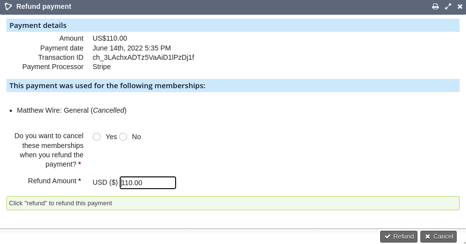

# Refunds UI
If supported by the payment processor (eg. Stripe) you can issue a full or partial refund from within CiviCRM.

It is enabled by default via the setting `mjwshared_refundpaymentui` which can be found at
*Administer->CiviContribute->Stripe Settings: Enable refund payment via UI?*

It allows you to issue refunds for `Completed` payments.

It also allows you to choose whether to cancel the **event registration** if there are any linked to the contribution (via line-items).

To access the refunds UI you must have **edit contributions** permission.

1. Click the "arrow" to expand the contribution and show payments.
2. To access the refund form click the "undo" icon by the payment:

You will see a refund form.

If the contribution was used to pay for a membership you can optionally cancel the membership:

If the contribution was used to pay for an event you can optionally cancel the event registration:

