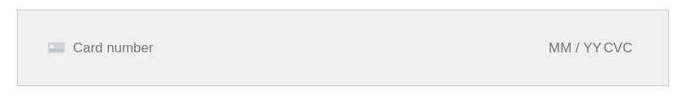

# Payment Methods

The Stripe extension provides two payment processors:

## Stripe Checkout

See: [Stripe Checkout](https://docs.stripe.com/payments/checkout).

This redirects to the Stripe Checkout page when you submit a CiviCRM payment form.

It is much simpler to implement, more reliable and supports multiple payment methods.
However, the disadvantage is that some organisations don't like to go off-site to process payment.

### Currently supported payment methods for Stripe Checkout:

* Card (any supported currency)
* BECS Direct Debit payments in Australia (AU Dollar)
* BACS Direct Debit (GB Pound)
* Bancontact (Euro)
* SEPA Direct Debit (Euro)
* ACH Direct Debit (US Dollar)

If a payment method is supported by Stripe (https://stripe.com/payments/payment-methods#search) it is usually simple to add it support for it in this extension.
Contact [MJW](https://www.mjwconsult.co.uk/en/contact-us/) for a quote!

## Stripe (Card Element)

This embeds a Stripe "Card Element" directly into the CiviCRM payment form.

See: [Stripe Card Element](https://stripe.com/docs/payments/payment-methods/overview#cards).

Configure a new Payment processor of type "Stripe" in CiviCRM.

Only card payments are supported.

### MOTO (Mail Order Telephone Order) Payments

If you want to take payments in this way you have to:

1. Request that it is enabled on your Stripe account.
2. Enable "MOTO payments" in CiviCRM Stripe settings (and choose if you want it enabled on backoffice and/or frontend forms).
3. Give the "CiviCRM Stripe: Process MOTO transactions" permission to roles which are allowed to process MOTO payments (eg. administrator).

Note (2024): This may no longer work for cards that require the CVV code - see https://chat.civicrm.org/civicrm/pl/7wnpn6nz83y77d6z1tc5dkaqeh
