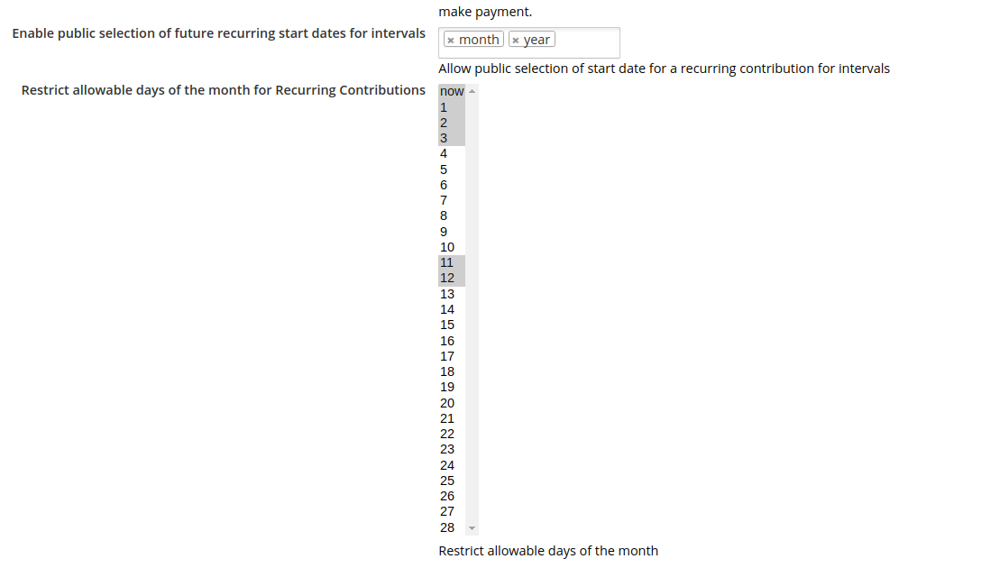
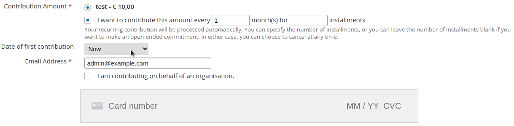
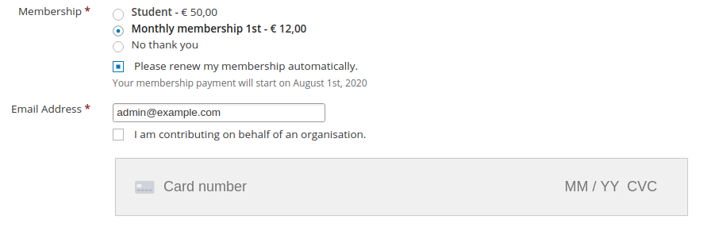
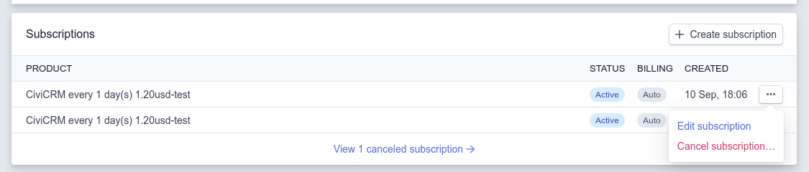
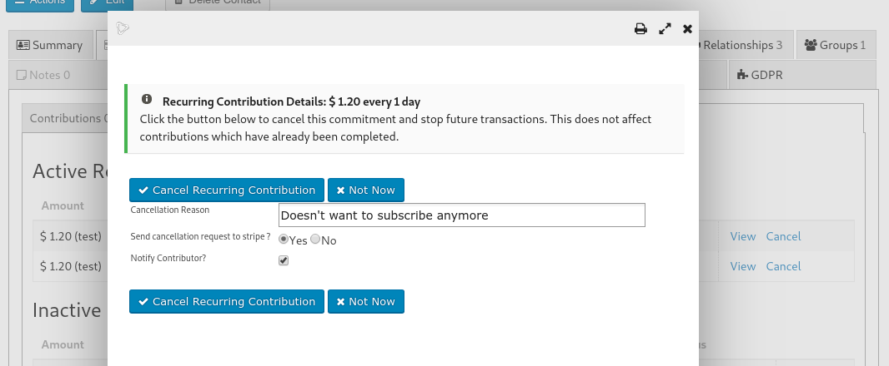
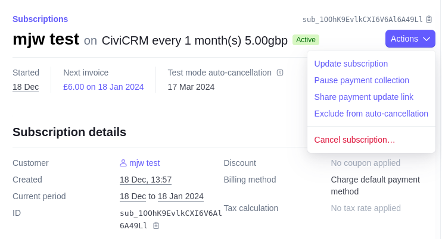
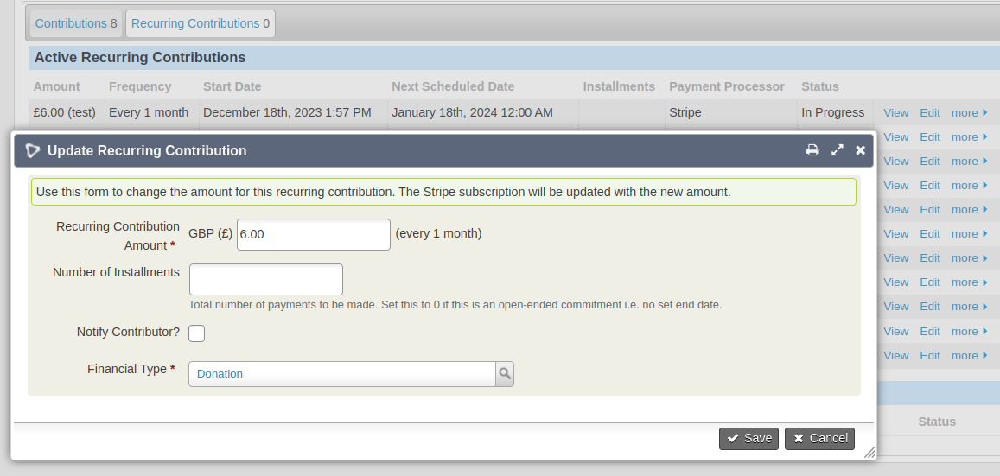

# Recurring Contributions

A CiviCRM **Recurring Contribution** is the equivalent of a Stripe **Subscription**.

The CiviCRM Recurring Contribution `trxn_id` = Stripe `subscription ID`.

When you create a recurring contribution in CiviCRM using the Stripe payment processor it is linked via the trxn_id to a Stripe subscription.

!!! tip "If you are using recurring contributions make sure you have webhooks configured correctly"
    See [Webhooks](webhook.md)

## Recurring statuses

Recurring contributions start in the status "Pending".

The Stripe subscription status is mapped to the recurring contribution status as follows:
(see `CRM_Stripe_Api::mapSubscriptionStatusToRecurStatus`):

      'incomplete' => 'Failed',
      'incomplete_expired' => 'Failed',
      'trialing' => 'In Progress',
      'active' => 'In Progress',
      'past_due' => 'Overdue',
      'canceled' => 'Cancelled',
      'unpaid' => 'Failed',

## Starting a Recurring contribution in the future
If you would like your users to be able to specify a future recurring start date you can enable
`Enable public selection of future recurring start dates for intervals` in *Administer->CiviContribute->Stripe Settings*.

Then your users will see an option to select a start date for the contribution:

Or if memberships are enabled on the form (example here for a single future start date on the 1st of the month):

## Cancelling Recurring Contributions
You can cancel a recurring contribution from the Stripe Dashboard or from within CiviCRM.

#### In Stripe

1. Go to Customers and then to the specific customer.
1. Inside the customer you will see a Subscriptions section.
1. Click Cancel on the subscription you want to cancel.
1. Stripe.com will cancel the subscription, send a webhook to your site and the recurring contribution will be marked as "Cancelled" in CiviCRM.

#### In CiviCRM
1. Click the "Cancel" link next to the recurring contribution.
1. Select the option to *Send cancellation request to Stripe?* and click Cancel.
1. Stripe.com will cancel the subscription, send a webhook to your site and the recurring contribution will be marked as "Cancelled" in CiviCRM.

## Editing / Updating Subscription

*Supported from Stripe 6.11*

You can update the amount of a Stripe Subscription / Recurring Contribution from the 
Stripe Dashboard or from within CiviCRM.

Stripe uses the following concepts:

    Subscription
    -->SubscriptionItem
       -->Product
       -->Price

So when updating a subscription we actually create a new Price for the Product and link them together.

### Notes

Stripe supports "pro-rata" subscription updates but this extension does not.
When making changes from CiviCRM pro-rata will automatically be disabled (ie. the new amount will take effect when the next invoice is issued).
When making changes from Stripe be sure to turn off pro-rata.

#### Updating a subscription in Stripe

1. Open the Stripe Dashboard.
1. Find the subscription you want to change.
1. Click Actions->Update subscription and follow the instructions.

#### Updating a subscription in CiviCRM

1. Find a recurring contribution using the "Contributions->Recurring Contributions" tab on the contact record.
1. Click "Edit" on the recurring contribution that you want to change the amount:
1. Enter the new amount (please ignore the "installments" field as will be hidden once [https://github.com/civicrm/civicrm-core/pull/28617](https://github.com/civicrm/civicrm-core/pull/28617) is merged).
1. Click "Save" - you'll see that the amount has been updated in CiviCRM and Stripe - the next invoice generated at Stripe will be for the updated amount.

### Bulk updates

If you'd like to make bulk updates to recurring contributions (for example a membership price increase)
we support the "Update Recurring Contributions" extension by @artfulrobot.
For now, please use the MJW version from here: [https://lab.civicrm.org/mattwire/upgraderecur/-/tree/mjw](https://lab.civicrm.org/mattwire/upgraderecur/-/tree/mjw)